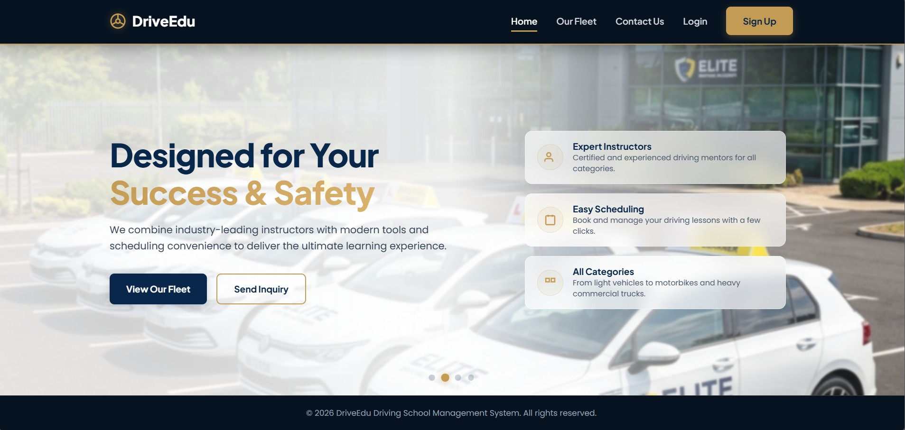
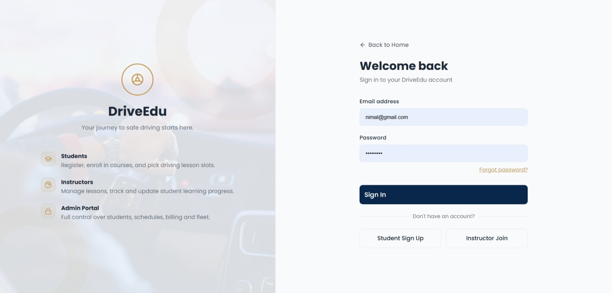
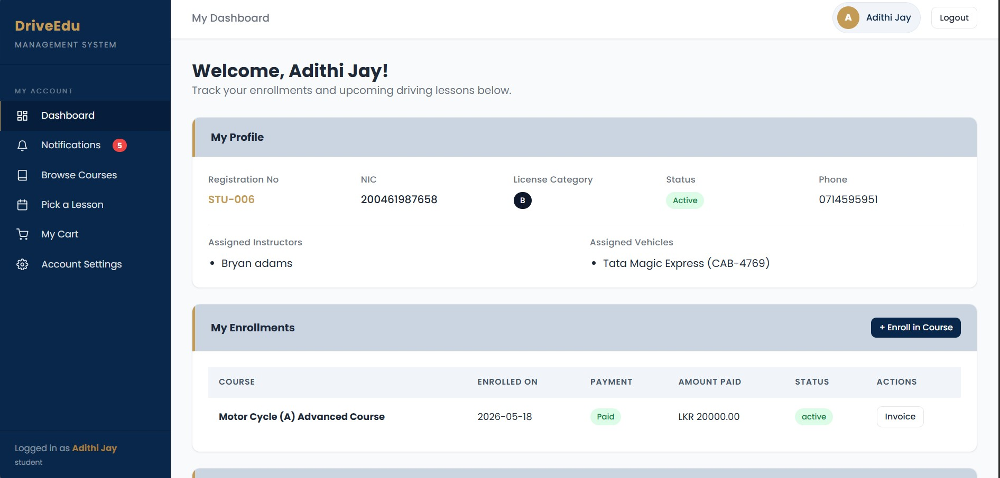
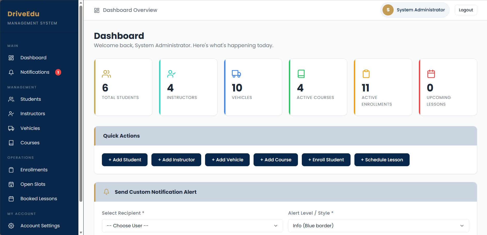
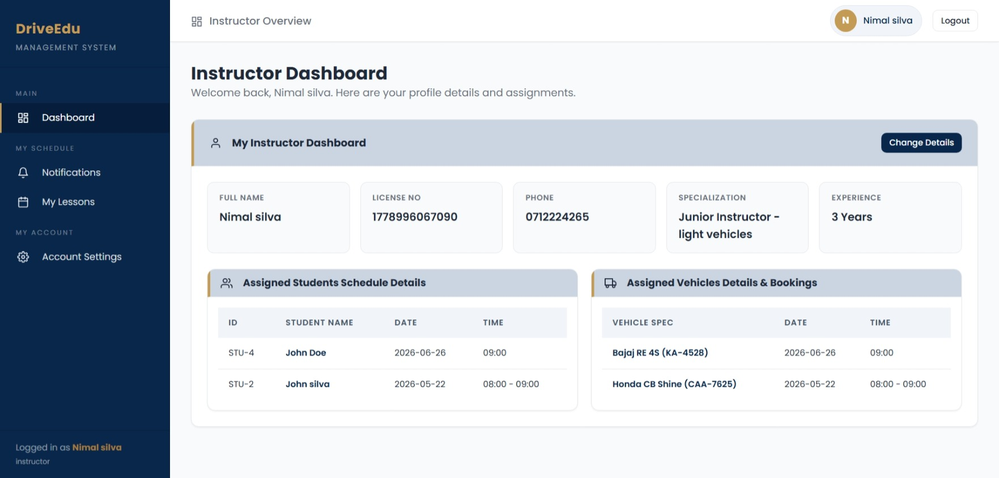
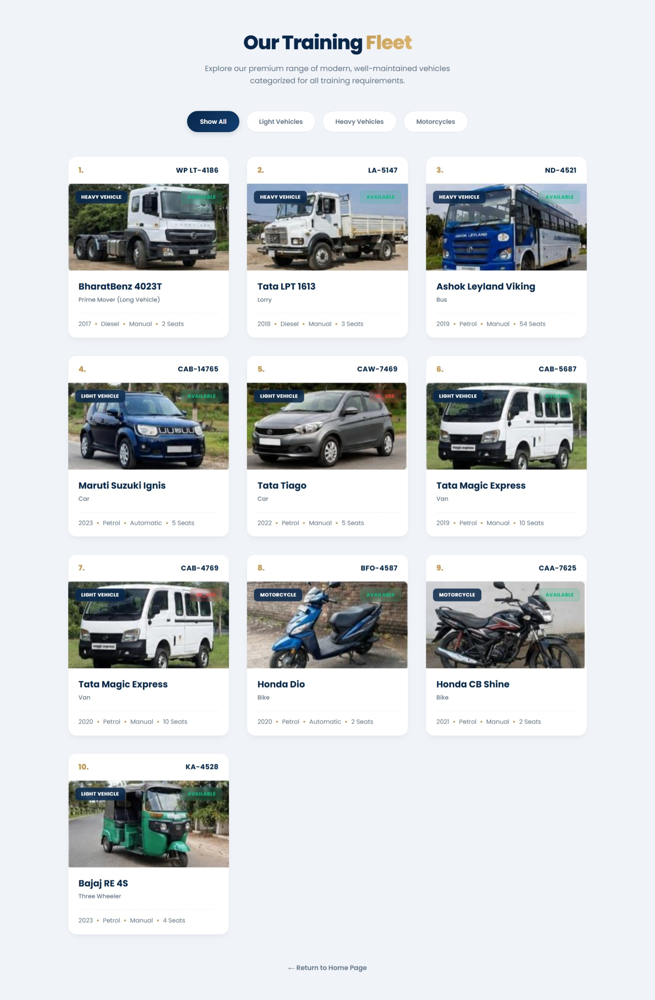
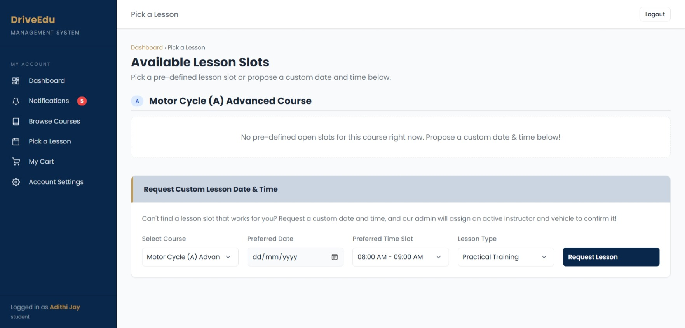

# 🚗  DriveEdu – Driving School Registration & Scheduling System
A comprehensive web-based Driving School Management System developed for the **Object Oriented Programming (SE1020)** module during **Year 1 Semester 2 (Y1S2)** at the **Sri Lanka Institute of Information Technology (SLIIT)**.

---

## 📖 Overview

DriveEdu is a web-based Driving School Management System designed to streamline driving school operations through a centralized platform. The system enables efficient management of students, instructors, lesson scheduling, vehicle fleets, course enrollments, and billing, providing a seamless experience for both administrators and learners.

---

## ✨ Features

* 🔐 Secure user authentication and role-based access control
* 👨‍🎓 Student registration and profile management
* 👨‍🏫 Instructor management and progress tracking
* 📅 Lesson scheduling and time slot booking
* 💳 Course package selection, billing, and payment management
* 🚗 Vehicle fleet management and maintenance tracking
* 🔔 Real-time notifications for lessons and system updates
* 📊 Administrative dashboard for system management

  ---
  
## 🛠️ Technologies Used

| Technology | Purpose |
|------------|---------|
| **Java** | Backend development and business logic |
| **JSP & JSTL** | Dynamic web page rendering |
| **HTML5** | Web page structure |
| **CSS3** | User interface styling |
| **JavaScript (ES6)** | Client-side validation and interactivity |
| **MySQL** | Relational database management |
| **Apache Maven** | Dependency management and project build |
| **Apache Tomcat** | Web application server |

---
## 📸 Website Design

| Homepage | Login |
|-----------|-------|
|  |  |

| Student Dashboard | Admin Dashboard |
|-------------------|-----------------|
|  |  |

| Instructor Dashboard | Fleet Management |
|----------------------|------------------|
|  |  |

| Lesson Scheduling |
|-------------------|
|  |

---

## 👥 Team Members

| Student ID | Team Member | Responsibility |
|------------|-------------|----------------|
| **IT25102735** | **Jayasekara E.O.** | Instructor Management & Student Progress Tracking |
| **IT25102749** | Dilshan S.A.I. | Student Profile Management & Notifications |
| **IT25102843** | Kisalma A.K.A.S. | Course Packages, Shopping Cart & Billing |
| **IT25102894** | Wijesinghe Y.N. | Vehicle Fleet Management |
| **IT25102905** | Aththanayaka A.B.V.K. | Lesson Scheduling & Time Slot Booking |
| **IT25103010** | Mahanama T.Y. | System Administration & Authentication |

---

## 📂 Project Structure

```text
DriveEdu/
├── src/
│   ├── controller/
│   ├── dao/
│   ├── model/
│   ├── service/
│   └── utils/
├── webapp/
│   ├── css/
│   ├── js/
│   ├── images/
│   ├── jsp/
│   └── WEB-INF/
├── websiteimages/
├── pom.xml
└── README.md
```

---

## 🚀 Getting Started

### Prerequisites

- Java JDK 21 or later
- Apache Tomcat
- Apache Maven
- MySQL Server
- IntelliJ IDEA or Eclipse

### Installation

1. Clone the repository:
  
2. Import the project as a Maven project.

3. Configure the MySQL database and update the database credentials.

4. Deploy the project on Apache Tomcat.

5. Run the application and open it in your web browser.

---

## 🎯 Key Learning Outcomes

Through the development of DriveEdu, our team gained practical experience in:

- Object-Oriented Programming (OOP)
- Java Servlets and JSP Development
- Model-View-Controller (MVC) Architecture
- JDBC Database Connectivity
- CRUD Operations
- MySQL Database Design
- Git & GitHub Collaboration
- Team-based Software Development

---
## 🎓 Academic Information

- **Module:** SE1020 – Object Oriented Programming
- **Institution:** Sri Lanka Institute of Information Technology (SLIIT)
- **Academic Year:** Year 1 Semester 2 (Y1S2)
- **Time Period:** February - June 
- **Project Type:** Group Project

---

## 📄 License

This project was developed for academic purposes as part of the **SE1020 – Object-Oriented Programming** module at the **Sri Lanka Institute of Information Technology (SLIIT)**.

© 2026 DriveEdu Team. All rights reserved.

